# Field tests

The tool run end to end on real machines in different countries, unattended.
Each host produced a console log, a machine-readable result, and screenshots of
the live map; all of it is under `logs/` and `photos/`.

Ground truth is a public IP geolocation lookup used only to score the result. It
never reaches the estimator, and on cloud hosts it is often poor: the last column
is how far the providers disagreed with each other, which bounds how much any
score here can mean.

| host | location | platform | backend | anchors | closest RTT | error | inside bound | truth spread |
|---|---|---|---|---|---|---|---|---|
| amsterdam-nl | Amsterdam, NL | Linux 6.8.0-1064-azure | tcp-connect * | 1570/1600 | 2.47 ms | 4.2 km | yes | 1 km |
| linux-us | Québec, CA | Linux 6.17.0-1022-azure | tcp-connect * | 1577/1600 | 3.87 ms | 248.2 km | yes | 0 km |
| macos-us | San Antonio, US | Darwin 25.6.0 | icmp-posix | 1564/1600 | 0.14 ms | 2306.2 km | no | 2,160 km |
| codespace-eastus | Boydton, US | Linux 6.8.0-1064-azure | tcp-connect * | 1585/1600 | 1.25 ms | 5.6 km | yes | 267 km |
| codespace-westus2 | Quincy, US | Linux 6.8.0-1064-azure | tcp-connect * | 1585/1600 | 4.86 ms | 191.7 km | yes | 45 km |
| pune-in | Pune, IN | Linux 6.8.0-1064-azure | tcp-connect * | 1581/1600 | 3.32 ms | 119.6 km | yes | 1 km |

`*` marks the TCP fallback, used where the network drops outbound ICMP.

## What this shows

* **5 of 6 hosts landed inside the reported radius**, including
  every host where the network blocked ICMP and the tool fell back to TCP.
* Accuracy tracks how close the host sits to an anchor, as the method predicts.
  The closest RTT sets the radius directly: hosts a few milliseconds from an
  anchor localise to single-digit kilometres, hosts tens of milliseconds away do
  not.
* **The one failure is a limitation worth knowing.** On the macOS runner a
  cluster of servers, each registered in one region, all answered from somewhere
  else at sub-millisecond latency. They agree with each other, so no
  leave-one-out test can separate them from honest anchors, and the constraints
  they impose cannot all be satisfied at once. That is now detected: the tool
  reports that the anchor set contradicts itself and labels the radius as not a
  bound, instead of printing a confident number.

## Per host

### amsterdam-nl

Amsterdam, NL &mdash; Linux-6.8.0-1064-azure-x86_64-with-glibc2.39
Python 3.14.2, 2 cpus, backend
`tcp-connect` (degraded, TCP fallback).

Estimate `52.3531, 4.94969` (at Amsterdam-Oost, The Netherlands), radius
&plusmn;681.1 km, error
**4.2 km**, inside bound:
True. 1570/1600 anchors
replied in 163.1 s.

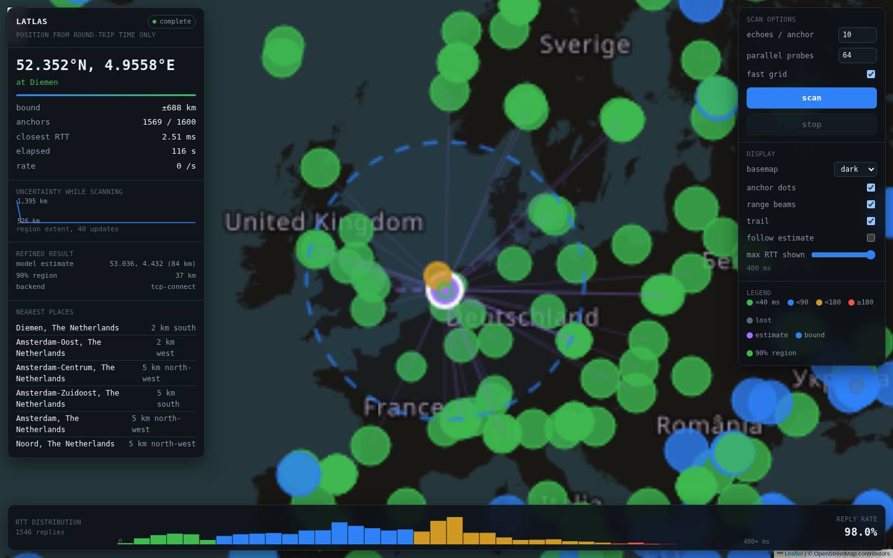
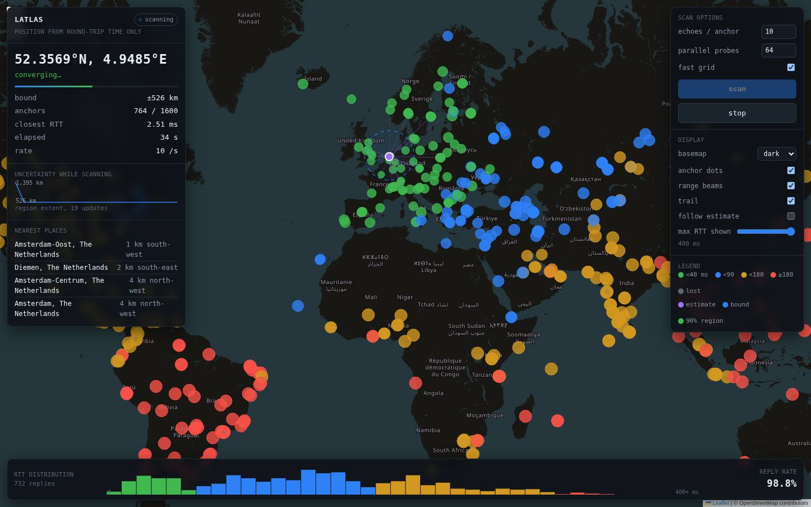

### linux-us

Québec, CA &mdash; Linux-6.17.0-1022-azure-x86_64-with-glibc2.39
Python 3.12.14, 4 cpus, backend
`tcp-connect` (degraded, TCP fallback).

Estimate `45.31601, -68.82694` (58 km south of Bangor, United States), radius
&plusmn;801.0 km, error
**248.2 km**, inside bound:
True. 1577/1600 anchors
replied in 135.5 s.

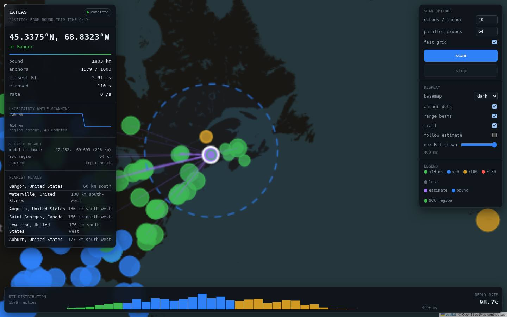
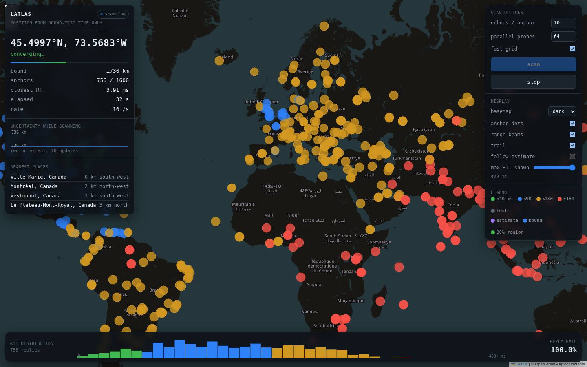

### macos-us

San Antonio, US &mdash; macOS-26.6.2-arm64-arm-64bit
Python 3.12.10, 3 cpus, backend
`icmp-posix`.

Estimate `48.7443, -117.19635` (116 km south of Post Falls, United States), radius
&plusmn;312.5 km, error
**2306.2 km**, inside bound:
False. 1564/1600 anchors
replied in 75.1 s.

**The bound failed on this host.** The anchor set contradicted itself: some constraints cannot be satisfied by any location, so no hard bound exists and the reported radius should not be read as one. See the log for the violation count. The ground truth here is also unreliable (providers disagree by 2,160 km).

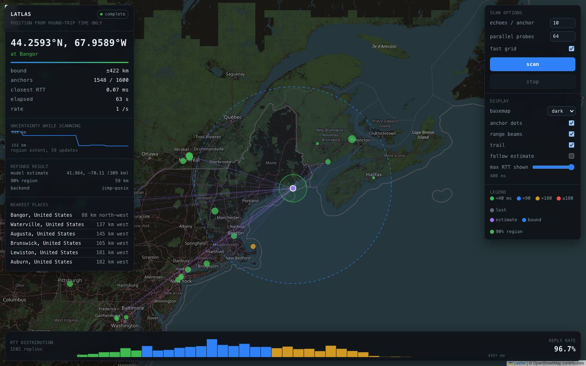
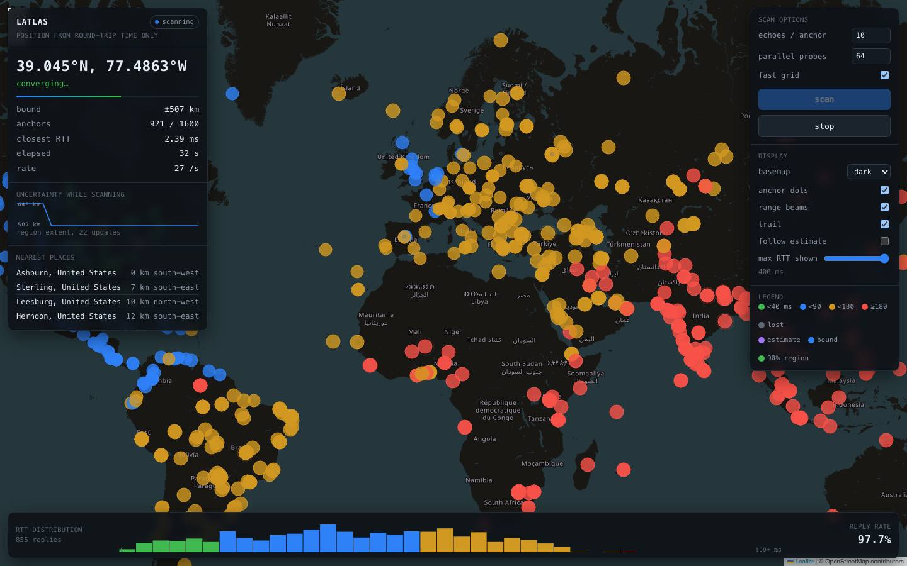

### codespace-eastus

Boydton, US &mdash; Linux-6.8.0-1064-azure-x86_64-with-glibc2.39
Python 3.14.2, 2 cpus, backend
`tcp-connect` (degraded, TCP fallback).

Estimate `39.0161, -77.45885` (at Sterling, United States), radius
&plusmn;443.3 km, error
**5.6 km**, inside bound:
True. 1585/1600 anchors
replied in 132.6 s.

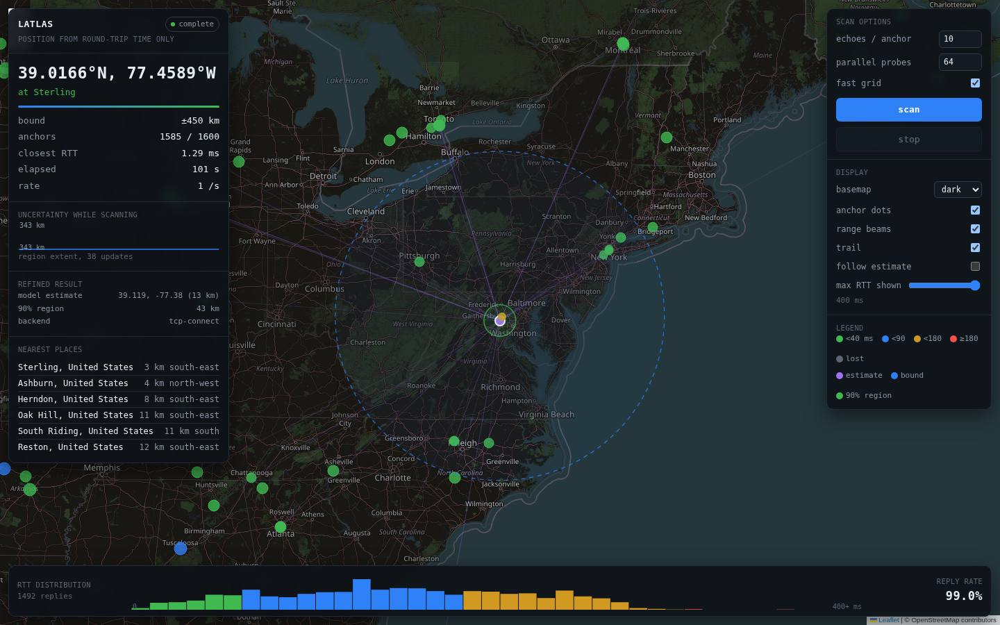
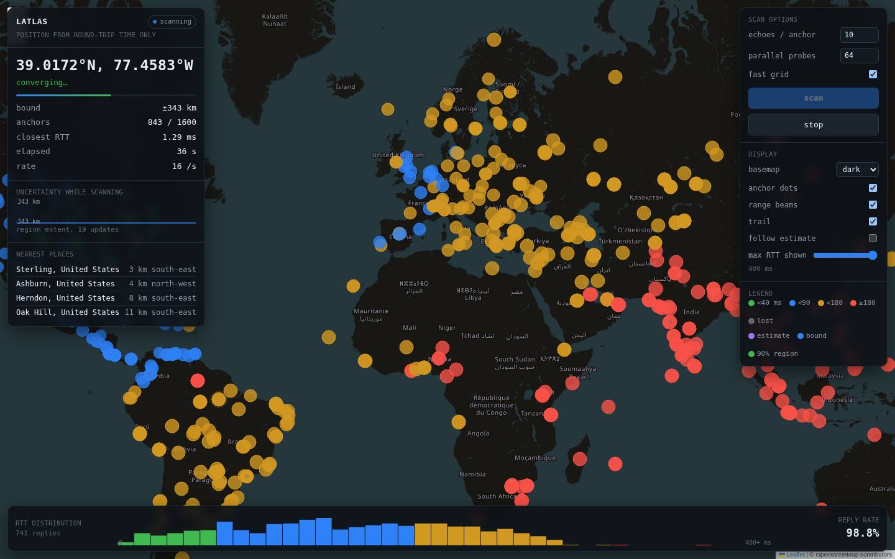

### codespace-westus2

Quincy, US &mdash; Linux-6.8.0-1064-azure-x86_64-with-glibc2.39
Python 3.14.2, 2 cpus, backend
`tcp-connect` (degraded, TCP fallback).

Estimate `47.61428, -122.33831` (at Seattle, United States), radius
&plusmn;1161.8 km, error
**191.7 km**, inside bound:
True. 1585/1600 anchors
replied in 138.2 s.

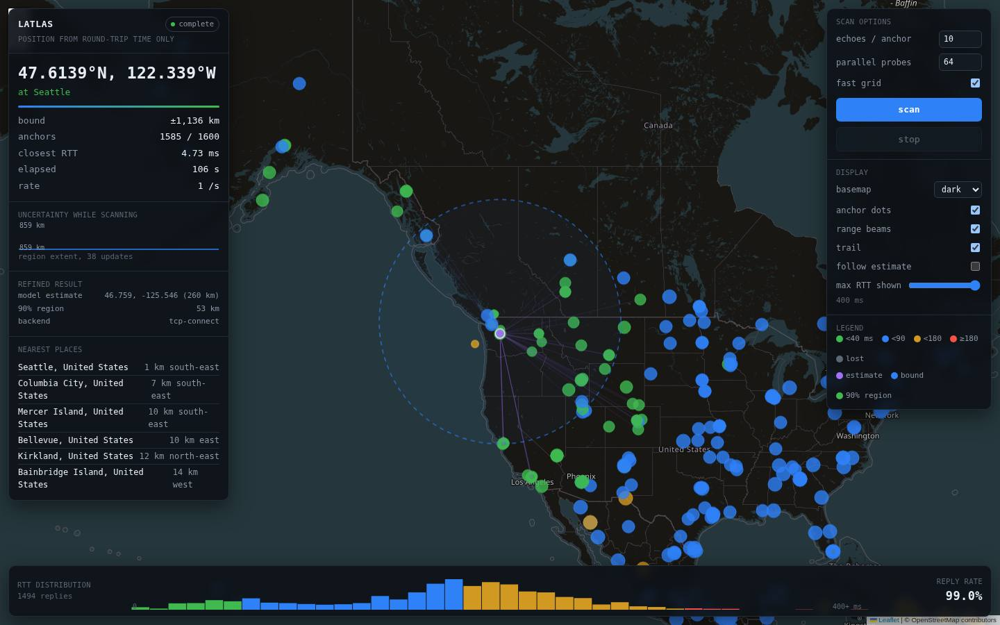
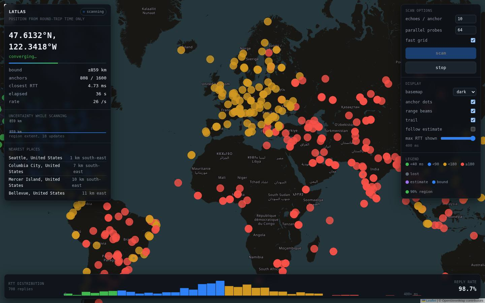

### pune-in

Pune, IN &mdash; Linux-6.8.0-1064-azure-x86_64-with-glibc2.39
Python 3.14.2, 2 cpus, backend
`tcp-connect` (degraded, TCP fallback).

Estimate `18.9641, 72.82189` (at Dhārāvi, India), radius
&plusmn;851.9 km, error
**119.6 km**, inside bound:
True. 1581/1600 anchors
replied in 167.1 s.

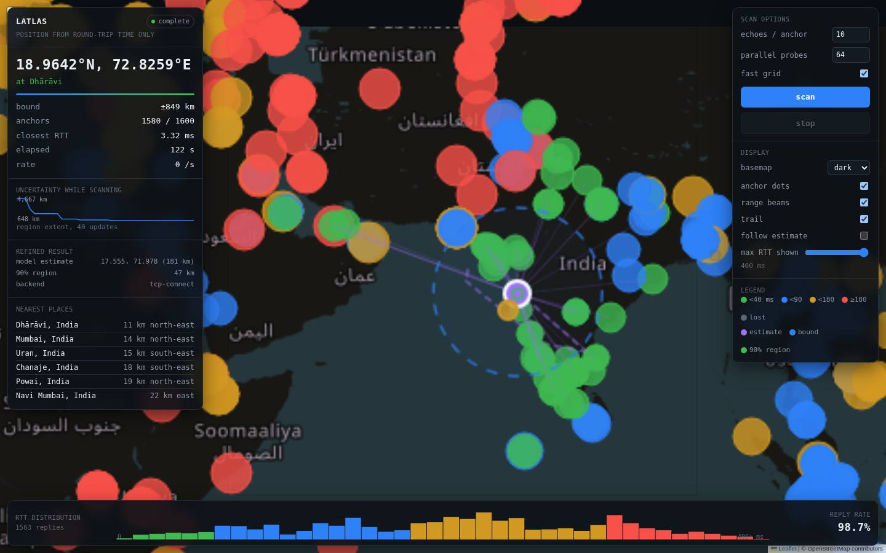
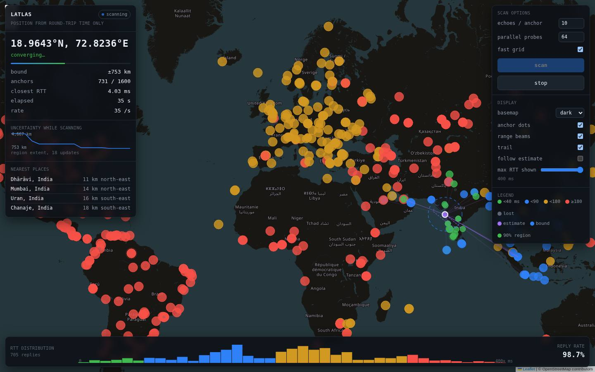

